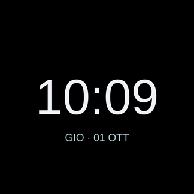
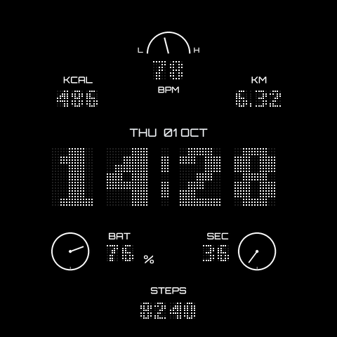
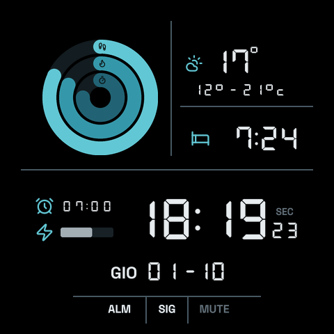

# Personal Amazfit Watchfaces

A small personal repository for developing Amazfit watchfaces. The first device is Amazfit Balance 2 XT.

## Watchfaces

Illustrative normal-mode previews. Essential's installation preview uses substitute font metrics.

| Watchface | Preview | Design |
| --- | --- | --- |
| [Essential](src/watchfaces/essential/README.md) |  | Minimal centered digital time and Italian/English date, with a dedicated AOD. |
| [Matrix](src/watchfaces/matrix/README.md) |  | Retro dot-matrix typography, activity metrics and a seconds dial, with minimal AOD. |
| [Retro LCD](src/watchfaces/retro-lcd/README.md) |  | Deep Ocean OLED theme, digital time, activity rings, weather, sleep, alarm and a continuous battery bar. |

## Current status

The first watchface, [Essential](src/watchfaces/essential/README.md), is implemented for Balance 2 XT (`deviceSource: 10486017`). The user confirmed local installation and correct watchface/AOD updates for 0.1.0. The watch selection preview was confirmed correct in 0.1.1, and the user accepted the Gadgetbridge preview correction in 0.1.2. Installation is local through Gadgetbridge; tagged builds can be distributed through automatic GitHub Releases.

- [Development plan](docs/development-plan.md): architecture, milestones and validation.
- [Device evidence](docs/device-validation.md): target information and physical checks.
- [Device target policy](docs/device-target-policy.md): full round 480 × 480 release coverage, compatibility and validation evidence.

[Matrix](src/watchfaces/matrix/README.md) is the second independent watchface: retro dot-matrix time, activity metrics and a seconds dial with minimal AOD. Build it with `npm run build -- matrix`; the user confirmed a successful trial on Balance 2 XT. Detailed device checks remain pending.

[Retro LCD](src/watchfaces/retro-lcd/README.md) is the third independent watchface, with the Deep Ocean OLED theme, activity instruments, weather, sleep, alarm time, a continuous battery bar and phone/DND statuses. Build with `npm run build -- retro-lcd`; local device screenshots have been reviewed, while final spacing and alignment checks remain pending.

## Repository layout

```text
src/watchfaces/       Independent watchface projects
scripts/              Explicit build and package tooling
tests/                Host-side behavior and tooling tests
docs/                 Development decisions and device validation
```

Each future watchface owns its `app.js`, `app.json`, `assets/`, `watchface/` and README. Keep rendering layouts separate from behavior when useful. Add shared adapters, utilities or declarations only when required; do not import code from a sibling watchface.

## Development approach

Use JavaScript with JSDoc and strict checking for owned code. Essential implements the approved centered time/date design with Italian and English labels and dedicated AOD. Approve visual previews before substantial design changes.

From the repository root:

```sh
nvm use
npm ci
npm test
npm run test:packaging
npm run typecheck
npm run build -- essential
```

CI runs tests, typecheck and the explicit Essential build; it has not yet run remotely. Use Node 24.19.0 and Zeus CLI 1.9.3. See Essential's README for setup, package output and Gadgetbridge installation.

## License

Original project work is covered by the [MIT license](LICENSE). Record the origin and applicable license of any third-party code, fonts or artwork introduced in future changes.

## Automatic GitHub releases

Pushing a tag such as `essential-v0.1.3` or `matrix-v0.1.0` or `retro-lcd-v0.1.0` starts the release workflow for that watchface only. The tag version must exactly match the selected watchface's `app.json`. After tests, typecheck and build succeed, the workflow publishes a GitHub Release with the validated device ZIPs from `dist/install` attached. Targets are limited to the selected watchface's checked-in round 480 × 480 catalog. Ordinary CI validates and builds all three watchfaces. It does not submit anything to the Zepp store.

Create the tag on the committed revision containing the intended manifest, source and workflow, then push that tag. Ordinary branch pushes and pull requests only run validation. Published releases are not overwritten on reruns; an existing release causes publication to fail.

The workflow uses GitHub's automatic token; no personal access token is required. Only the publication job receives write permission. Release publication must be verified for each pushed tag.
